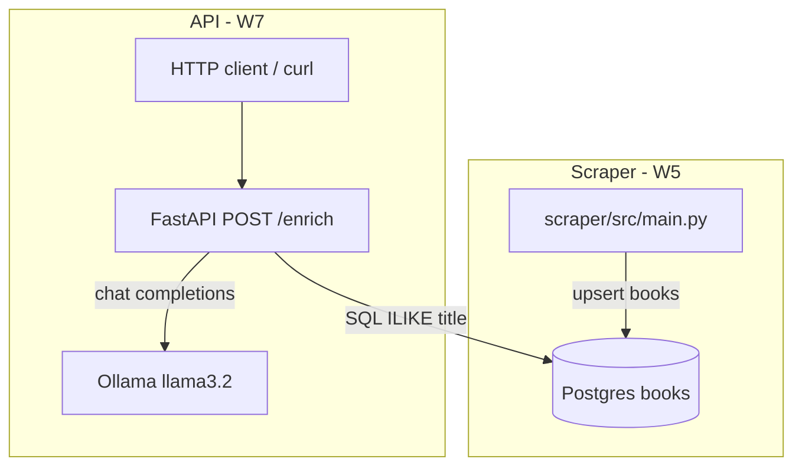
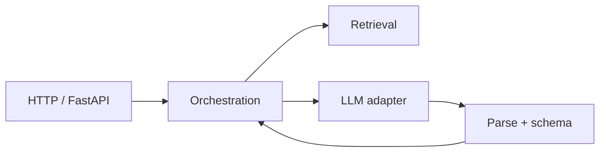
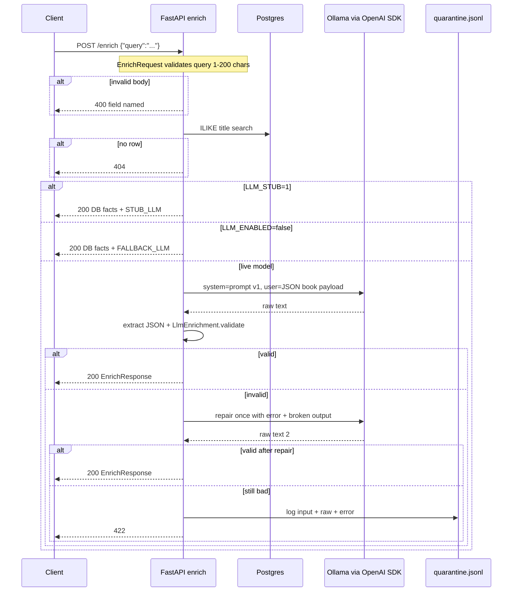
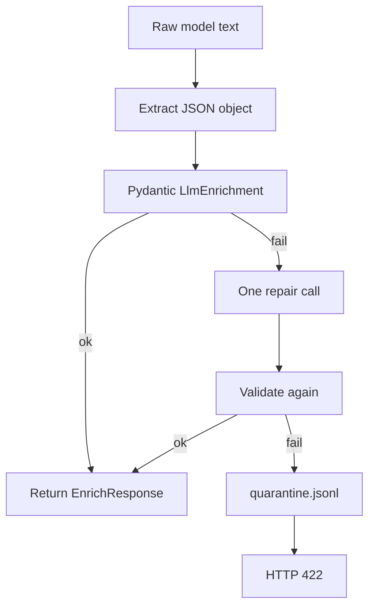

# Architecture: Book Enrich API (W7)

This system is a **narrow LLM feature behind an HTTP API**, not an agent or chatbot. The design principle: **code owns facts and control flow; the model only fills a closed judgment schema**.

---

## 1. System context — two apps, one database



| Piece | Role |
|---|---|
| [`scraper/`](scraper/) | Crawls Books to Scrape, validates records, upserts into Postgres |
| [`api/`](api/) | HTTP + LLM enrichment; **does not scrape** |
| Postgres `books` | Shared source of truth for catalogue facts |

They stay separate on disk so scraping and serving don’t share process lifecycle, deps, or failure modes — but they share `DATABASE_URL`.

---

## 2. Core design idea: split “retrieve” from “judge”

W7 teaches that an LLM is a **slow, non-deterministic, sometimes-wrong external API**.

| Concern | Who owns it | Why |
|---|---|---|
| Find the book | **SQL** in [`api/src/db.py`](api/src/db.py) | Exact lookup — models invent titles |
| Price, URL, title | **DB row** | Facts must not be hallucinated |
| Category, type, summary, confidence | **LLM** | Fuzzy judgment |
| Shape of LLM output | **Pydantic schema** | Untrusted until validated |
| Timeouts / retries / kill switch | **Your code** | Production control |

That is why this is **not** “an agent with Google search.” Retrieval is deterministic code; enrichment is one structured model call.

---

## 3. Layered layout

```text
api/
  JOB-CARD.md              # product contract (what correct means)
  prompts/enrich-v1.md     # versioned system prompt (spec for the model)
  evals/                   # labeled cases + scorer
  src/
    main.py                # HTTP orchestration
    db.py                  # retrieval
    llm/
      schema.py            # input/output contracts
      client.py            # provider I/O + timeout/retry
      parse.py             # parse → validate → quarantine
      cost.py              # observability
```

Mental model of layers:



---

## 4. End-to-end request flow



Implemented in [`api/src/main.py`](api/src/main.py) as:

1. Validate input (`EnrichRequest`)
2. Retrieve book (`find_book_by_query`)
3. Branch: stub / kill switch / model
4. Merge DB facts + LLM fields into `EnrichResponse`
5. Never return raw model text

---

## 5. Contracts (the “schema-first” architecture)

### Input contract — [`EnrichRequest`](api/src/llm/schema.py)

- `query`: 1–200 chars, stripped  
- Failures become **400** before any DB/LLM spend  

### LLM-only contract — [`LlmEnrichment`](api/src/llm/schema.py)

Closed enums:

- `category`: fiction | mystery | romance | scifi | history | self_help | other  
- `book_type`: novel | series | nonfiction | young_adult | other  
- `confidence`: 0.0–1.0  
- `quality_flags`: closed literal list  

This is the only surface the model is allowed to invent.

### Public API contract — [`EnrichResponse`](api/src/llm/schema.py)

Merges:

- From DB: `matched_title`, `product_url`  
- From LLM: judgment fields  

Job card ([`JOB-CARD.md`](api/JOB-CARD.md)) is the human-readable version of this contract — written **before** trusting model output.

---

## 6. Retrieval architecture

[`find_book_by_query`](api/src/db.py):

```sql
WHERE title ILIKE %query%
ORDER BY exact match first, then shortest title
LIMIT 1
```

Properties:

- Deterministic  
- No LLM in the loop  
- Missing book → **404** (and no model call)  

That enforces “must never invent a book not in the database.”

---

## 7. Prompt architecture

[`prompts/enrich-v1.md`](api/prompts/enrich-v1.md) is treated as **versioned code**:

| Part | Purpose |
|---|---|
| Role | What job the model is doing |
| Output shape | Exact JSON + enums |
| Rules / must-never | Hard constraints |
| When unsure | Prefer `other` + low confidence |
| Examples | Teach shape faster than adjectives |

Message split (important for safety):

- **System**: prompt file (your instructions)  
- **User**: `json.dumps({title, description, ...})` — untrusted catalogue text stays outside the system prompt (prompt-injection hygiene)

Temperature `0.2` + `max_tokens=120` bias toward short, stable JSON.

---

## 8. LLM adapter architecture

[`client.py`](api/src/llm/client.py) uses the OpenAI SDK pointed at Ollama:

```text
LLM_BASE_URL + LLM_API_KEY + LLM_MODEL
```

That is **provider abstraction by config**: same code can target OpenRouter/Gemini by changing three env vars.

Production controls:

| Control | Behavior |
|---|---|
| Timeout 60s | Avoids SDK’s ~10-minute default; maps to **504** |
| `max_retries=0` on SDK | You own retries |
| Custom retries | Only timeout / 429 / 5xx; never 400/401/403 |
| Backoff + jitter | 1s, 2s, 4s + random |
| Cost log | prompt version, model, tokens, duration, repair count |

---

## 9. Trust boundary: parse → validate → repair → quarantine

Model output is **untrusted external data** (same mindset as W6 scraper validation).

Flow in [`parse.py`](api/src/llm/parse.py) + [`main.py`](api/src/main.py):

1. Strip markdown fences / extract `{...}`  
2. `LlmEnrichment.model_validate` (enums, ranges)  
3. On failure: **exactly one repair call** with the validation error  
4. On second failure: append `logs/quarantine.jsonl`, return **422**  
5. Process stays up — no crash, no silent default pretending success  



---

## 10. Operational modes (control plane)

| Mode | Env | Meaning |
|---|---|---|
| Live | `LLM_STUB=0`, `LLM_ENABLED=true` | Real Ollama calls |
| Stub | `LLM_STUB=1` | Dev stand-in; schema-valid; no model |
| Kill switch | `LLM_ENABLED=false` | Prod off-switch; deterministic fallback |

Stub ≠ kill switch: stub is for building; kill switch is for incidents/cost/outages.

---

## 11. Failure taxonomy (API contract)

| HTTP | When |
|---|---|
| **400** | Bad/missing `query` (before LLM) |
| **404** | No DB match |
| **422** | Model output invalid after one repair |
| **502** | Provider/network error |
| **504** | Model timeout |
| **200** | Schema-valid enrichment (live, stub, or fallback) |

Clients can rely on this without parsing free-form model prose.

---

## 12. How this fits the W7 lesson

The architecture encodes the assignment’s six-line pipeline:

```text
validate input → build versioned prompt → call model
→ parse+validate → repair once → return clean JSON or 422
```

Plus production habits: timeout, selective retries, cost logging, kill switch, and an eval set (`evals/`) so quality is measurable when the prompt changes.

---

**One-sentence summary:** a FastAPI façade that **retrieves books from Postgres**, asks Ollama for a **closed judgment**, and only emits **schema-validated JSON** under explicit failure and ops controls.